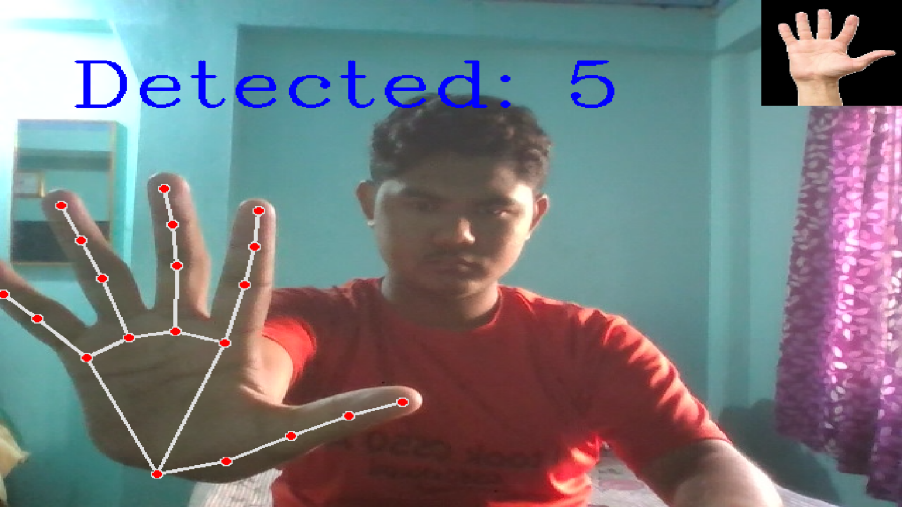

# Finger Counter

A real-time finger counting application using **OpenCV** and **MediaPipe Hands**.  
This project detects your hand from webcam input and counts the number of fingers raised, displaying the count along with a visual overlay.

---

## Features

- Real-time hand detection with MediaPipe
- Accurate finger counting for both left and right hands
- Visual landmarks and hand connections displayed on the video feed
- Sample finger images overlay showing the count
- Fullscreen display window for better user experience
- Easy to extend and customize

---

## Demo



---

## Getting Started

### Prerequisites

- Python 3.7+
- OpenCV (`opencv-python`)
- MediaPipe (`mediapipe`)
- (Optional) Tkinter for GUI version

### Installation

1. Clone the repository:
   ```bash
   git clone https://github.com/Bishal-Stha/HiFive.git
   cd HiFive

### Contact
- Gmail: [Bishal Shrestha](programmerbishal@gmail.com)
- Project Link: [HiFive](https://github.com/Bishal-Stha/HiFive)

